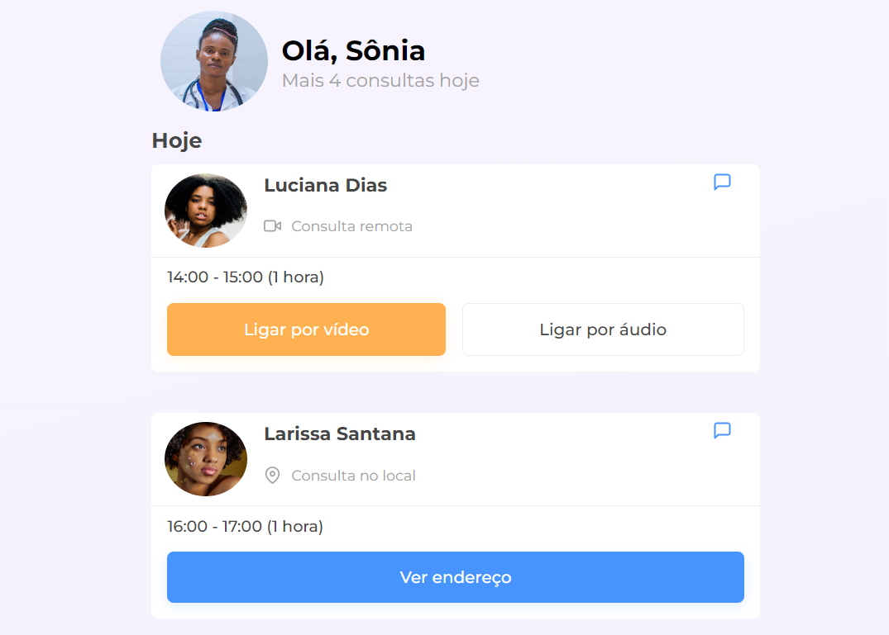

# Projeto 7DaysOfCode

## Testando meu conhecimento de HTML e CSS

Testei meu conhecimento de responsividade utilizando css3. Também apliquei um pouco de acessibilidade atráves do HTML.

 ## Imagem de exemplo do projeto 7DaysOfCode realizado por mim

